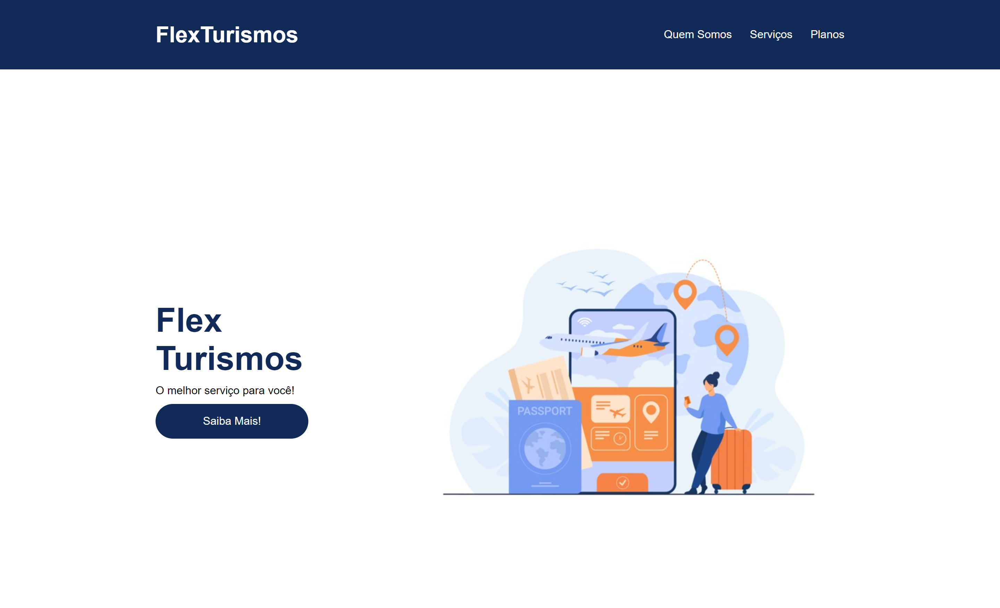

# Criando a interface Flex Turismo

Esse é o repositório do desafio de projeto do bootcamp **Spread Fullstack Developer** , na qual foi desenvolvido em aula criando o layout do site Flex Turismo.

## ✅ Funcionalidades

<ul style="list-style: none;"> 
    <li>[X] Responsividade do layout</li>
</ul>