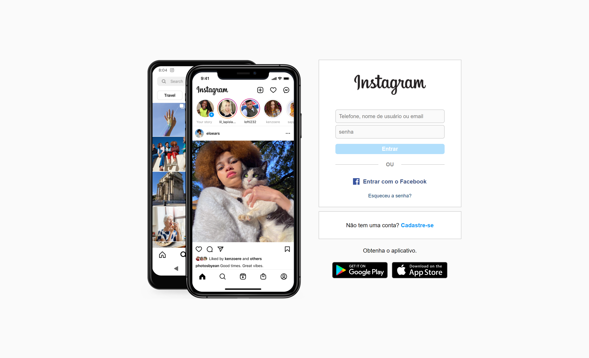

# Criando a interface de login do Instagram

Esse é o repositório do desafio de projeto do bootcamp **Spread Fullstack Developer** , na qual foi desenvolvido ainterface de login do Instagram.

## ✅ Funcionalidades
 
[ ] Habilitar o botão de entrar ao preencher os campos do formulário
[ ] Efeitos de slide nas imagens do smartphone
[ ] Responsividade do layout
