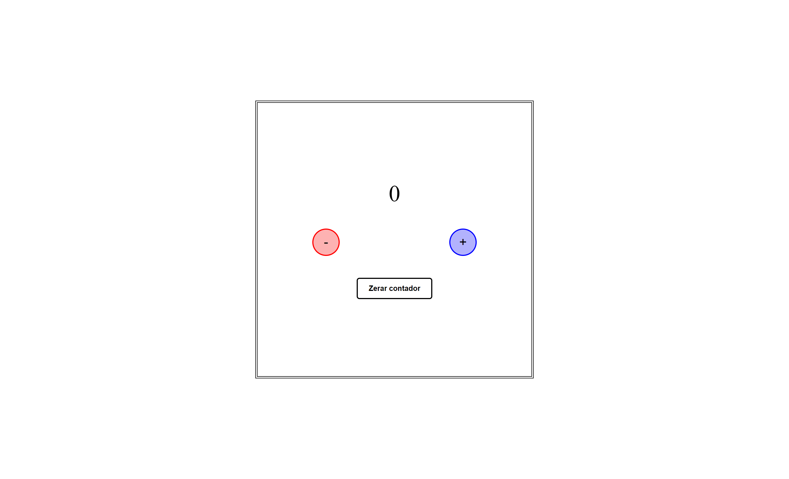

# Criando um contador

Esse é o repositório do desafio de projeto do bootcamp **Spread Fullstack Developer** , na qual foi desenvolvido um contador com javascript.

## ✅ Funcionalidades

<ul style="list-style: none;">     
    <li>[X] Incrementa o número</li>
    <li>[X] Decrementa o número</li>
    <li>[X] Reseta o valor, voltando para 0 o contador</li>
    <li>[X] Caso o número seja negativo, sua cor muda para vermelho</li>
</ul>