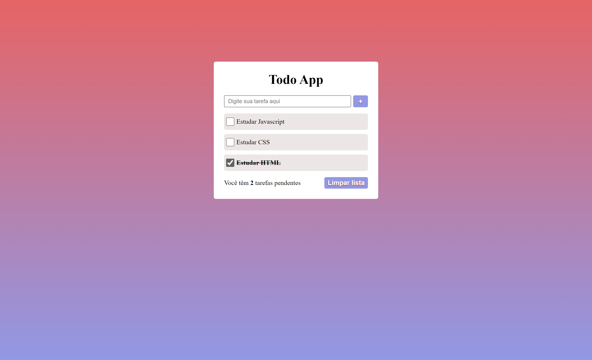

# Criando um todo list

Esse é o repositório do desafio de projeto do bootcamp **Spread Fullstack Developer** , na qual foi desenvolvido um todo list com javascript.

## ✅ Funcionalidades

<ul style="list-style: none;">     
    <li>[X] Adicionar tarefa a lista</li>
    <li>[X] Quando marcada como feita, riscar o texto</li>
    <li>[X] Limpar toda a lista</li>
    <li>[X] Incrementar o contador de tarefas pendentes quando adicionar uma tarefa</li>
    <li>[X] Decrementar o contador de tarefas pendentes quando marcar uma tarefa</li>
</ul>