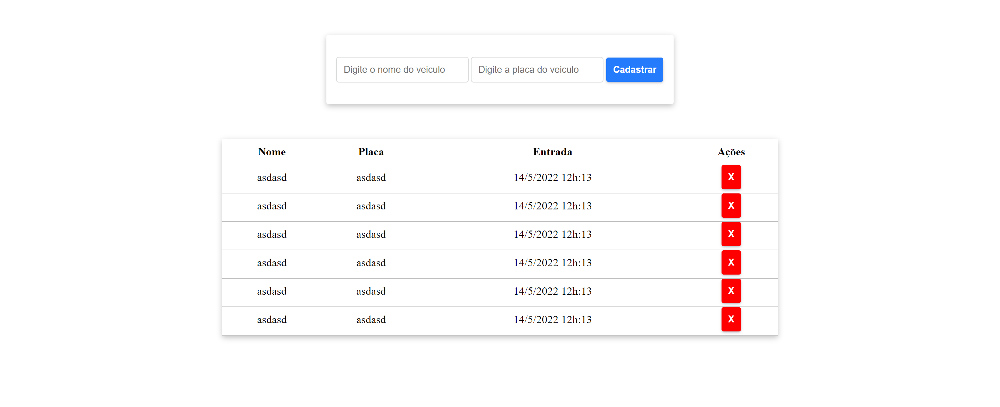

# Criando um sistema de estacionamento usando typescript

Esse é o repositório do desafio de projeto do bootcamp **Spread Fullstack Developer** , na qual foi desenvolvido um sistema de estacionamento.



## ✅ Funcionalidades

<ul style="list-style: none;"> 
    <li>[X] Adicionar veiculo</li>
    <li>[X] Remover veiculo</li>
    <li>[X] Salvar veiculo no localstorage</li>
    <li>[X] Carregar os veiculos salvos do localstorage</li>
</ul>

## Modificação

Caso queira adicionar ou modificar alguma funcionalidade, realizar alteração
no arquivo <strong>main.ts</strong> e rodar o seguinte comando no seu terminal:

```javascript 
    npx -p typescript tsc
```